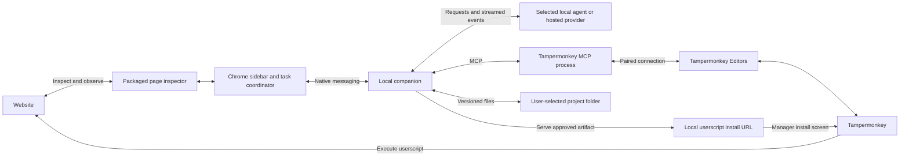

# Script Monkey: first-version plan

Planning date: 2026-10-01. This document describes proposed work; no extension, companion, or integration has been implemented or tested in a browser.

## Product and first milestone

A Chrome sidebar agent that understands the current website, generates or modifies a userscript, installs it through an existing userscript manager, observes the result, and retains recoverable project history on disk.

The first complete example is: “Add a button at the top right that opens the export menu without going through the nested menus.” A second example edits an existing script while preserving its earlier behavior. Success includes installation, reload, inspection, a follow-up edit, and rollback.

See [manager research](userscript-manager-research.md) for compatibility evidence. Recommendations below are design decisions, not claims that interoperability has already been tested.

## Integration decision

Start with **Tampermonkey and its official Editors/MCP bridge**, subject to the initial browser feasibility test. Its official MCP project documents list, get, and patch operations; create and delete additionally require Tampermonkey 5.6+ and Editors 1.0.6+. The currently documented stable Chrome release is 5.5.0. New-script installation therefore needs a conventional userscript install flow as the baseline. [MCP documentation](https://github.com/Tampermonkey/tampermonkey-mcp), [Chrome changelog](https://www.tampermonkey.net/changelog.php?ext=dhdg)

Retain Violentmonkey as the second adapter, initially using script import/export and its documented local development workflow. Do not promise full access to its installed library until an external API is verified. Greasemonkey belongs to a later Firefox version, rather than the initial Chrome scope.

Reuse the official Tampermonkey relay instead of assuming an arbitrary extension ID can access Tampermonkey directly. This adds Editors and a local MCP process to onboarding, but avoids relying on undocumented private messages. Normalize MCP responses before using them as source artifacts, and serialize manager operations. Review the bridge's pairing, connection, and timeout behavior before relying on it in a shipped product; see the research note for source-level limits.

Adapters report capabilities separately: list, read, update, create, install handoff, installation readback, enable/disable, and delete. An advertised MCP tool alone does not prove the connected manager supports it. Unsupported operations degrade to a visible import/install workflow; errors are not treated as success.

## Proposed architecture

Chrome provides a native side panel. Content scripts provide DOM inspection, while native messaging connects the extension to an installed local application. These are distinct APIs and permissions. [Side panel](https://developer.chrome.com/docs/extensions/reference/api/sidePanel), [content scripts](https://developer.chrome.com/docs/extensions/develop/concepts/content-scripts), [native messaging](https://developer.chrome.com/docs/extensions/develop/concepts/native-messaging)

The extension owns the sidebar and binds each action to a project, tab, URL, and document. The companion owns durable jobs, disk writes, provider connections, and the manager bridge. The manager owns script execution and its own runtime storage. Project storage and manager storage are synchronized through explicit revision records rather than pretending they are one database.

Use TypeScript for the extension and companion, with shared message schemas. Keep the sidebar UI modest until the integration works. Select a packaging framework after the feasibility tests; framework choice does not resolve the main uncertainty.

## User workflow

1. Connect the companion, select a project folder, choose a provider, and pair Tampermonkey Editors once.
2. Open the sidebar on a supported website. Show which tab and site the conversation is targeting.
3. Choose a new customization or an existing script. Retrieve existing source through the manager bridge, or import source when unavailable. Preserve an untouched initial copy on disk.
4. Describe the goal and optionally select an element or record a short sequence of clicks. Capture relevant page structure and state changes.
5. Produce a draft userscript and a readable diff. Show its site scope and any newly requested userscript grants.
6. Save a durable revision before applying it. Patch an existing script when supported; otherwise open the manager's install/update screen with the exact artifact.
7. Read back installed source when supported, then reload the target tab. Inspect whether the requested behavior appears and works. Record source identity and behavioral evidence separately.
8. Continue the same project conversation across reloads and sidebar reopening. A follow-up edit starts from the latest source actually retrieved from the manager.
9. Roll back by restoring a previous source revision through the same update/install path and verifying it after reload.

Suggested states: inspecting, drafting, draft saved, awaiting installation, source verified, testing, behavior verified, needs revision, conflict, and interrupted. “Install screen opened” is not “installed,” and “source saved” is not “feature works.”

## Page understanding and testing

Start with targeted live DOM observations: URL, visible text, semantic labels, selected-element ancestry, relevant attributes, and nearby controls. The agent can request a fresh observation rather than receiving the entire document repeatedly. Optional screenshots help when structure does not explain the visual layout.

“Show me” recording gathers click targets and DOM changes while the user performs the existing workflow. It must not record typed passwords or every keystroke. Treat page content as observation data, not instructions controlling the local agent or companion.

Use standard content-script capabilities first. Do not claim they expose arbitrary application variables, every event handler, closed shadow trees, or all frames. Additional frame access and application-state inspection are later, explicit capabilities. [Content-script execution environments](https://developer.chrome.com/docs/extensions/develop/concepts/content-scripts#isolated_world)

Test under the real selected manager so its userscript grants, injection timing, and execution environment match the installed result. The first examples use DOM-only scripts, preferably with no privileged grants. Do not substitute a homegrown preview runtime and claim identical behavior.

For the export shortcut, evidence means one new button is present; clicking it reaches the intended menu; repeated clicks do not duplicate controls; the original menu still works; and reload and relevant navigation preserve the shortcut. Use a small controlled test site before an arbitrary production site. This is a future test fixture, not work performed during planning.

Observe DOM behavior and script-reported diagnostics where available. General console/network capture would require an additional mechanism and is not a baseline promise. Instrumentation must not silently rewrite unrelated imported code or present script self-report as authoritative proof.

## Disk persistence and recovery

For the primary product path, the companion writes real files to a user-selected folder. Extension storage is a cache and reconnect aid. An extension-only export mode may be added later, but manual exports alone do not satisfy continuous disk backup.

Proposed project contents:

| File or folder | Purpose |
| --- | --- |
| `project.json` | Stable ID, sites, script identities, schema version, and current revision pointers |
| `scripts/<id>/revisions/<revision>.user.js` | Immutable source revisions, including the initial imported original |
| `scripts/<id>/current.user.js` | Convenient current candidate for editing and export |
| `conversation.jsonl` | Durable requests, decisions, and task events |
| `checks/<revision>.json` | Source readback status and behavior observations |
| `imports/` | Original supplied artifacts when useful for restoration |

Use atomic writes, immutable revisions, checksums, and recoverable manifests. Persist long-running job IDs and events so reopening the panel can reconnect without repeating a mutation. Chrome may terminate its service worker and discard in-memory state, so conversation or installation state cannot depend on globals. [Worker lifecycle](https://developer.chrome.com/docs/extensions/develop/concepts/service-workers/lifecycle)

Track draft revision, last manager source retrieved, last source applied, and last behavior verified independently. Before updating, compare current manager content with the edit's starting content; use the bridge's modification-time condition where available and surface conflicts rather than overwriting an external edit. Serialization of our own operations does not prevent edits made through the manager itself.

Rollback restores code. It cannot automatically undo every page action or changes to a script's `GM` values. A source backup is not a backup of all runtime data. The first version must state this accurately; manager storage backup support can be added separately.

Provide single-script export and a full portable project archive, including revisions and conversation but excluding credentials. Restore must rebuild the library without depending on the original browser profile. Keep provider credentials separate from project records.

When modifying third-party scripts, preserve attribution and record their upstream URL. Explain whether the user is editing the upstream-managed copy or making a personal fork: upstream automatic updates can replace personal edits. Do not silently remove update metadata or assume code rollback restores third-party state.

## Agent and provider integration

The browser cannot simply attach to every existing terminal agent. Each local agent needs a supported transport and an adapter for session events, cancellation, structured tool calls, and authentication. A local model endpoint is another provider type, not automatically a full local-agent integration.

The user selected **Codex CLI**. Prefer its app-server interface over terminal automation: start a project thread, resume it by saved ID, submit turns, stream events, and interrupt active turns. The installed CLI reports version 0.158.0 and exposes app-server with stdio transport. Official documentation also covers client-provided dynamic tools, which are experimental and must be checked against the installed version. [Codex app-server documentation](https://learn.chatgpt.com/docs/app-server)

Use a dedicated project thread rather than silently attaching to an unrelated terminal session. Let Codex handle its supported login mechanism; do not scrape credentials from another session. Pin and check protocol compatibility. If dynamic tools prove unsuitable, expose the same bounded tool interface through a dedicated Script Monkey MCP adapter. Keep raw Tampermonkey mutation tools behind the coordinator so both routes preserve revision records.

Complete the first loop with Codex before implementing a hosted-provider adapter. The provider abstraction leaves room for API-key providers later. The common interface covers start, resume, stream, cancel, and an explicit capability report. Persistent project context belongs to Script Monkey, even if a provider session disappears or the user switches providers.

Give the agent bounded tools: inspect page, retrieve script, create draft, request apply, and inspect test evidence. The coordinator performs disk writes and manager operations through their adapters; do not let agent output bypass revision tracking by calling raw write tools on its own. Local CLI execution uses a configured executable and arguments, and project data remains separate from executable instructions.

Provider endpoint permissions and page scope are granted as needed. The sidebar identifies the selected provider and what page material is being sent. Chrome supports optional permissions and host permissions for extension requests and page access. [Permission model](https://developer.chrome.com/docs/extensions/develop/concepts/declare-permissions)

## Installation and distribution constraints

Ship the inspector and UI as packaged extension code. Generated userscripts are handed to the existing manager for execution. Do not evaluate generated strings as ordinary extension code. Chrome's Manifest V3 policy restricts remote-code execution and documents specific exceptions, including the User Scripts API. [MV3 policy](https://developer.chrome.com/docs/webstore/program-policies/mv3-requirements)

If a built-in preview executor is proposed later, it needs its own userScripts permission, site permissions, and the appropriate user toggle. That API returns scripts registered by the calling extension; it does not read another manager's library. This is a separate design choice, not a workaround for missing manager access. [User Scripts API](https://developer.chrome.com/docs/extensions/reference/api/userScripts)

Treat Chrome Web Store approval as unproven until reviewed. Plan an unpacked development build first. Onboarding must accurately cover the companion, Editors pairing, manager permissions, and version-dependent features.

The Tampermonkey beta changelog reports changed `.user.js` URL handling in Chrome 152+ and an inline installer in response. Test the exact Chrome/manager combination; retain a manager import/editor fallback rather than making URL interception a permanent assumption. This is a maintainer-reported compatibility constraint, not behavior verified here. [Tampermonkey beta changelog](https://www.tampermonkey.net/changelog.php?show=gcal)

## Existing products and product focus

The broad idea already exists. [Tweeks](https://www.tweeks.io/) and [Shaper](https://getshaper.app/) advertise natural-language website customization. [Tweeks' April changelog](https://web.nextbyte.ai/changelog/2026-04-15-changelog) also documents a local MCP bridge with Codex support. [Customaise](https://customaise.com/compare/tampermonkey) advertises local-agent page inspection, userscript generation, live validation, and existing-script editing. [Epupp](https://github.com/PEZ/epupp) combines live editor/agent access with persistent scripts.

See [existing-product comparison](existing-products.md) for findings and explicit unknowns. Existing-manager integration, disk-backed project history, and a sidebar that coordinates Codex are candidate reasons to build this product, not proven unique features. Before committing to a broad product build, compare those concrete requirements against existing tools. Avoid building another generic userscript generator merely because the category was hard to find in a quick search.

## Implementation sequence after planning

| Phase | Work | Completion evidence |
| --- | --- | --- |
| 1. Manager feasibility | Check close existing tools against the intended workflow; connect official relay in an isolated browser profile; enumerate, retrieve, edit, install new source, reload, and roll back | Recorded manager/Editors/MCP versions and a reproducible complete loop; unsupported capabilities and existing-product gaps recorded |
| 2. Durable workspace | Companion protocol, revision files, event journal, export, restore, and conflict handling | Browser-state loss and interrupted writes do not lose a saved project; external edits are detected |
| 3. Page understanding | Sidebar, selected-element inspection, short workflow recording, target-document binding | Agent can explain the export path from observations; changing tabs does not redirect an existing job |
| 4. First agent | Codex app-server adapter, persistent context, drafts and diffs | Codex completes the controlled customization and resumes after panel reopening |
| 5. Full edit/test loop | Apply, source readback, reload, observation, follow-up edit, and rollback | Both the new-script example and existing-script example pass under the real manager |
| 6. Additional compatibility | Violentmonkey fallback, one hosted API provider, and broader site behavior | Capability differences are visible and do not produce false installation claims |

Phase 1 is deliberately small: validate interoperability before building a polished chat interface. If the official bridge cannot support a dependable read/edit loop, revise the adapter design before progressing.

## Decisions still to verify

- Installed stable/beta manager behavior, pairing persistence, and precise version capability detection.
- Localhost install handling, confirmation, and source readback after installing a new script.
- Match-pattern evaluation and whether listing filters correspond to actual eligible scripts, rather than simple name or text matching.
- Permissions added during an update and whether enablement or other manager settings change.
- Codex app-server protocol compatibility, controlled tool access, resumable transport, and later hosted provider choice.
- Minimum Chrome version, initial OS packaging target, and companion installation experience.
- Behavior for cross-origin frames, single-page navigation, and scripts changed externally while the agent drafts.

These are future feasibility checks. No software has been installed, browser profile modified, or application code written as part of this planning pass.
